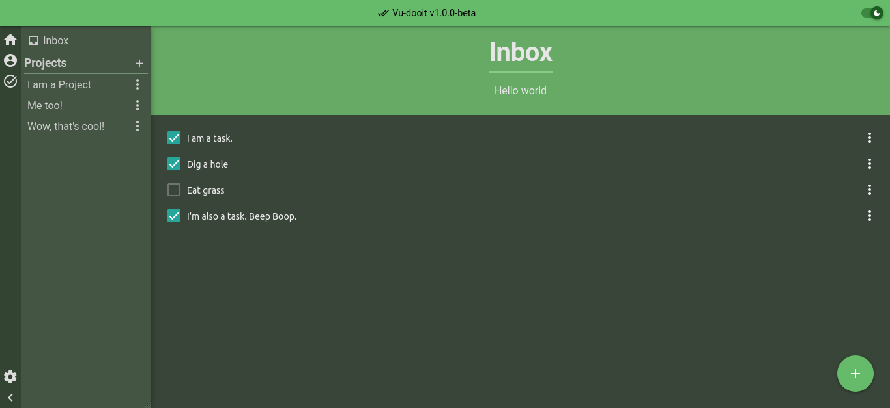

<h1 align="center">Vu-dooit</h1>
<p align="center">An open source and cross-platform Task Manager, completely offline.</p>





## About the Project(Features)

- Create multiple projects, organize your tasks.
- All your data is saved locally, through Indexeddb.
- No tracking or anything similar.
- An unfinished dark mode

## Installation

### Clone Repository

- Get HTTPS link
  

- Open your terminal and type "git clone" and paste the HTTPS link you copied to clone the project locally
  ```bash
  git clone https://github.com/github-username/vu-dooit.git
  ```
- Locally locate that project's directory using terminal
  ```bash
  C:\OSS> cd vu-dooit
  ```

### Install the dependencies

```bash
yarn
# or
npm install
```

### Start the app in development mode (hot-code reloading, error reporting, etc.)

```bash
# to open on browser:
quasar dev
# to open on browser but in desired port
quasar dev --port=8080
# or with Electron:
quasar dev -m electron
```

### Lint the files

```bash
yarn lint
# or
npm run lint
```

### Format the files

```bash
yarn format
# or
npm run format
```

### Build the app for production

```bash
quasar build
```

<!-- Clone repository, install dependencies, npm run build:electron (or yarn equivalent) -->

<!-- This should build it for your platform. If you use linux, you can download the latest release [here](#) -->

---

### Customize the configuration

See [Configuring quasar.config.js](https://v2.quasar.dev/quasar-cli-vite/quasar-config-js).
